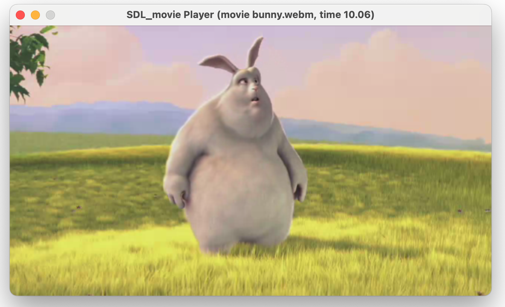

# GleedSDL



This is a simple library for playing **.webm** movies with SDL3. It is intended to be mostly used for playing short cinematics in games, but cautious usage for other purposes is also possible.

⚡️ Experimental until said elsewise. 😜

Note: library was renamed from SDL_Movie to Gleed to avoid confusion with official SDL satellite libraries.

## Features

- Provides SDL-like C API
- API mostly inspired by RAD's Bink Video, but with focus on open-source formats and codecs
- Supports .webm files with **VP8** or **VP9** for video codecs, and **Vorbis** or **Opus** for audio codecs
- Provides utility functions for playing back video frames into `SDL_Texture` and rendering with `SDL_Renderer`
- Audio samples may be directly fed to `SDL_AudioStream`

## Building and linking

You can build the library with CMake. It has the following dependencies:

- `libvpx` for VP8 and VP9 decoding
- `libvorbis` and `libogg` for Vorbis decoding
- `libwebm` for WebM parsing
- `libopus` for Opus decoding

They are downloaded and build automatically via CMake FetchContent module, so in general you don't need to worry about them.

The only problem is that if you are using SDL_mixer for example, it also depends on `libvorbis` and `libogg`, which causes these dependencies to be built/linked twice. I am open to suggestions on how to solve this issue.

Note: you will need a C++ compiler to build this library, as `libwebm` parser is written in C++, which is used internally by SDL_movie.

## Usage

See [basic.cpp](examples/basic.cpp) for a simple example playing Big Buck Bunny short trailer using more low-level `GleedMovie` object.

See another [player.cpp](examples/player.cpp) with more high-level `GleedMoviePlayer` object, which handles all the timing and synchronization for you and is the **recommended way** to use the library, unless you have specific needs.
It allows also selecting a movie out of different codec variants.

The API is documented in the header file itself: [gleed.h](include/gleed.h).

The general workflow for `GleedMovie` is the following:

1. Open a .webm file with `GleedOpen(path)` or `GleedOpenIO(io_stream)`, obtaining a `GleedMovie*` handle.
2. Optionally, select an audio or video track with `GleedSelectTrack`. If not called, the first video and audio tracks are selected by default.
3. In the application loop, call `GleedDecodeVideoFrame` to decode video frame, and `GleedDecodeAudioFrame` to decode audio frame.
4. On success, do useful rendering with video pixels (`GleedGetVideoFrameSurface`) and audio samples (`GleedGetAudioSamples`)
5. Call `GleedNextVideoFrame` and `GleedNextAudioFrame` to advance to the next frame. Use `GleedHasNextVideoFrame` and `GleedHasNextAudioFrame` to check if there are more frames to decode.
6. When done, call `GleedFreeMovie` to free resources.

**However**, the main problem with that workflow is that it all timing and synchronization is left to the user. Doing the process above at a frame rate higher than the movie's original will cause inconsistent playback speed and audio desync.

Therefore, it's advised to use `GleedMoviePlayer`. Aside from handling timing for you, it also supports:

- Directly feeding audio output to your SDL_AudioDevice.
- Pausing
- Disabling audio or video playback, if needed
- Automatic frame rate adjustment
- Automatic calculation of time delta (pass `GLEED_PLAYER_TIME_DELTA_AUTO` as second argument to `GleedUpdatePlayer`)
- _Probably will support seeking in future_

Very quick example with the player (no error checking):

```cpp
// Initialization

GleedMovie* movie = GleedOpen("bunny.webm");

GleedMoviePlayer* player = GleedCreatePlayer(movie);

SDL_Texture *video_frame = GleedCreatePlaybackTexture(
        movie, renderer);

GleedSetPlayerVideoOutputTexture(player, video_frame);
GleedSetPlayerAudioOutput(player, audio_device); // your SDL_AudioDevice, already opened

// Update loop
GleedUpdatePlayer(player, GLEED_PLAYER_TIME_DELTA_AUTO); //second argument is time delta, you can provide your own

// Rendering
SDL_RenderCopy(renderer, video_frame, NULL, NULL); // render video frame

// Cleanup
GleedFreePlayer(player);
GleedFreeMovie(movie, true);
GleedDestroyTexture(video_frame);
```

## Why WebM?

I wanted to use a simple, open-source, free and relatively modern container format - although things like AVI, MP4 and MKV are more popular, they are either too old, too proprietary, or too complex for my needs. WebM is a nice subset of Matroska, containing everything needed for replaying short cinematics, as descrbied earlier.

## Why not just use ffmpeg and support all formats?

I have 2 reasons for that:

1. ffmpeg is _big_ and kinda-overkill when you have control over the input format for your video assets, allowing you to choose one.
2. I wanted to learn how low-level codecs APIs and struggle a bit :D

## How can I convert my video to WebM for Gleed?

Use `ffmpeg`:

```bash
ffmpeg -i input.mp4 -c:v libvpx -c:a libvorbis output.webm
```

You may also use Opus as audio codec:

```bash
ffmpeg -i input.mp4 -c:v libvpx -c:a libopus output.webm
```

## Stability note

Please note, that this library was mostly written for educational purposes, and this was my first time working with low-level codecs such as VP8 and Vorbis, therefore, it may contain bugs or memory leaks. Use it at your own risk, and feel free to report any issues or suggestions.

## Hardware acceleration

For now, it does not support it, only accelerations available are implemented by codecs themselves (like multithreading, maybe). I have not yet researched this topic so far.

## Memory usage

This library uses quite a lot of dynamic memory allocations, but in general it should not have much impact on memory usage, as most allocations are for one-frame buffers.

Although, as an option, you may explicitly call `GleedPreloadAudioStream` to preload whole audio track into memory for a smoother playback at a cost of longer loading time and higher memory usage.

## License

[MIT](LICENSE)
